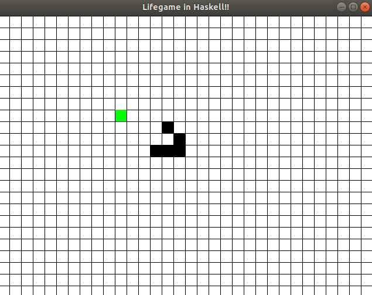

# hslifegame

Lifegame implemented in Haskell with Gloss



# Installation and Run

``` 
$ git clone https://github.com/rect1114/hslifegame && cd ./hslifegame
$ stack run
```

# Control

|key|control|
|-|-|
|q or esc|quit|
|Space|change play or stop|
|Left|move cursor to left|
|Down|move cursor to down|
|Up|move cursor to up|
|Right|move cursor to right|
|Enter or MouseLeftButton|change cell to dead or live|
|MousePosition|move cursor|